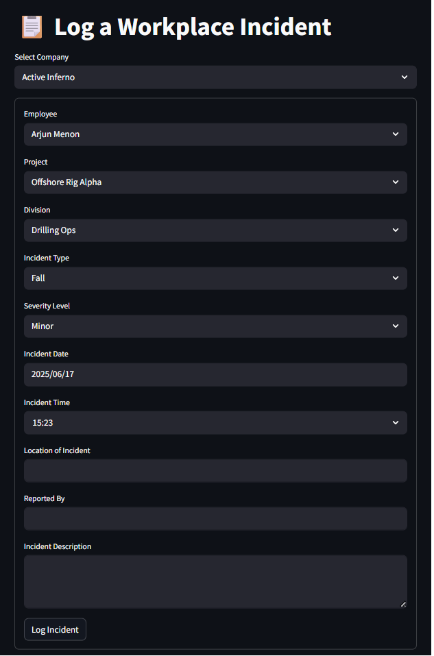
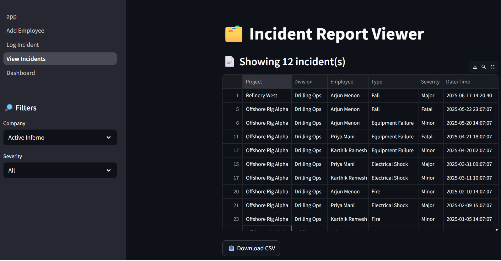
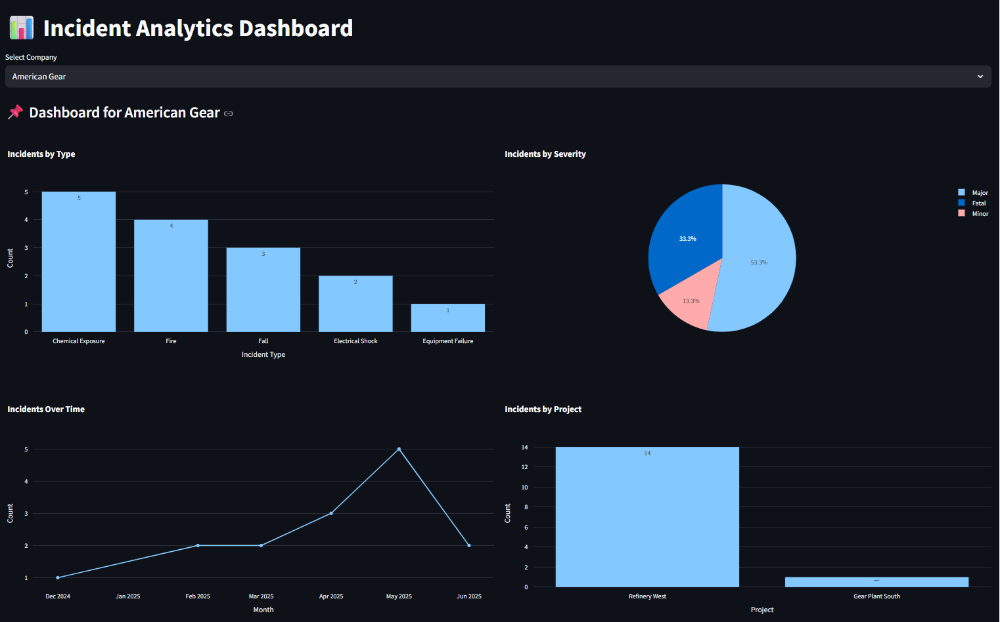

# 🛠️ SafetyVerve App

A Streamlit-based MVP to log and visualize incidents in high-risk industries like Oil & Gas, Construction, and Mining.

## 🔧 Features

- Log incidents by Company, Project, Division, and Employee
- View incident list with filtering and download
- Dashboards:
  - Incidents by Type, Severity, Project
  - Trend analysis over time

## 🧱 Tech Stack

- Python
- Streamlit
- SQLite
- Plotly

## 🚀 Run Locally

```bash
git clone https://github.com/your-username/SafetyVerve.git
cd SafetyVerve
pip install -r requirements.txt
streamlit run app.py
```
## 💻 Screenshots
### 1. Log Incident Page


### 2. View Incidents


### 3. Dashboard
